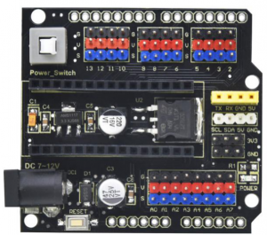

# KS0485 Keyestudio NANO Shield With DC End (Black and Eco-friendly)

## 1. Description

We particularly design this shield to make up the problem of connecting the sensor shield to keyestudio NANO control board .

This keyestudio NANO shield has extended the digital and analog ports out as 3PIN interface (G-GND V-5V S-digital port/analog port) It also breaks out some communication pins/female headers of 2.54mm pitch, like I2C and serial communication.

Additionally, the power is supplied from Power_Switch self-locking switch to NANO shield after the inputting DC 7-12V to DC head.

With external power input, the keyestudio NANO shield provides power to NANO control board on the one hand; it stably outputs 5V (output current 1.5A) to power the external sensor / module by voltage regulator chip L7805 on the other hand. At last, 5V can transfer into 3.3V via AMS1117-3.3V chip, and led out by pins.

The shield comes with a reset button and 1 signal indicators as well. Two rows of 2.54mm pad holes reserved on the side can lead out all external interfaces of the NANO control board. The 4 MS fixing holes make the shield fixed on the other devices easier.

## 2. Parameters

- External input voltage: DC 7-12V
- Output current: 1.5A
- Maximum power: 7W
- Working temperature: -20 ℃ --60 ℃
- Size: 57.3 * 53.5mm
- Pin Header / Female Header Pitch: 2.54mm
- Direct fixing hole: 3mm
- Environmental attributes: ROHS